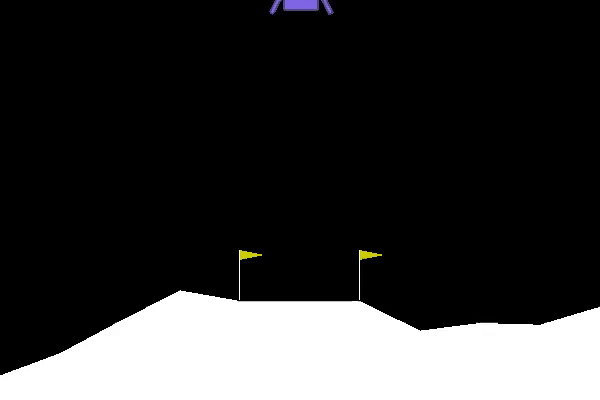
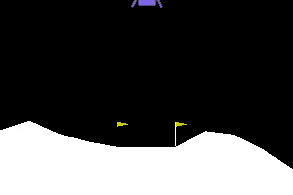

# LunarLander-v2 for AE4311
Implementation of OpenAI Gym's [LunarLander-v2](https://gym.openai.com/envs/LunarLander-v2/) for the AE4311 Advanced Flight Control course at TU Delft.

Before training            |  After training
:-------------------------:|:-------------------------:
  |  

## Installation
Tested on Ubuntu 18.04, with Python 3.6.5. Ensure all Ubuntu repositories are enabled (can be done with `sudo add-apt-repository universe restricted multiverse`)
```bash
$ sudo apt install -y python3-numpy python3-dev cmake zlib1g-dev libjpeg-dev xvfb xorg-dev python3-opengl libboost-all-dev libsdl2-dev swig
$ git clone https://github.com/Huizerd/lunarlander.git
$ cd lunarlander
$ python3 -m venv venv
$ source venv/bin/activate
$ pip install -r requirements.txt
```

## Running the simulator
To run the default configuration:
```bash
$ python -m lander
```
Of course, other configurations can be specified. See `config/config.yaml.default` for the default values.
An example configuration, saved under `config/config.yaml`, would be:
```yaml
# Environment and agent
ENV_ID: 'LunarLander-v2'
ENV_SEED: 0
AGENT: 'doubledqn'

# Data locations
# NOTE: setting RECORD_DIR to an existing directory will overwrite!
# NOTE: CHECKPOINT_DIR can be anything when CONTINUE is False
RECORD_DIR: 'record/doubledqn/'
CHECKPOINT_DIR: ''

# Run config
EPISODES: 1000
SAVE_EVERY: 100
STATE_BINS: [5, 5, 5, 5, 5, 5, 2, 2]  # per state dimension
STATE_BOUNDS: [[-1.0, 1.0], [-1.0, 1.0], [-1.0, 1.0], [-1.0, 1.0],
               [-1.0, 1.0], [-1.0, 1.0], [-1.0, 1.0], [-1.0, 1.0]]  # per state dimension
VERBOSE: 1  # 0: nothing, 1: plots and saved videos, 2: every episode
CONTINUE: False

# Learning parameters
# Format: start value, end value, # of episodes, decay factor
# NOTE: linear slope between start and end, then exponential decay
# NOTE: use 0 as # of episodes to do only exponential decay
E_GREEDY: [1.0, 0.05, 1e5, 0.97]
LEARNING_RATE: [5e-5, 5e-5, 0, 1]
DISCOUNT_RATE: 0.99

# Network parameters
L2_REG: 1e-6
UPDATE_EVERY: 100
REPLAY_MEMORY_SIZE: 1e6
BATCH_SIZE: 64
LAYER_SIZES: [512, 512, 512]
```

Which would then be called like this:
```bash
$ python -m lander -c config/config.yaml
```

## Agents
As of now, the available agents are:
- Random
- Sarsa
- Q-learning
- Double deep Q-learning

## Environment
Additional information about the environment can be found on the environment's [webpage](https://gym.openai.com/envs/LunarLander-v2/), or in the [source code](https://github.com/openai/gym/blob/master/gym/envs/box2d/lunar_lander.py).

### Actions
There are four discrete actions the lander can take:
- `0`: Do nothing
- `1`: Fire left thruster
- `2`: Fire main thruster
- `3`: Fire right thruster

### State
The state vector consists of eight variables (in this order) between -1 and 1:
- Lander position in x
- Lander position in y
- Lander velocity in x
- Lander velocity in y
- Lander angle
- Lander angular velocity
- Contact left landing leg
- Contact right landing leg

To make the learning problem (more) tractable, the state can be discretized into a certain number of bins.

## Grid search
A grid search over different hyperparameter combinations can be performed using `grid_search.py`:

```bash
$ python lander/grid_search.py
```

which uses the default configuration and grid. Custom variants can be called like this:

```bash
$ python lander/grid_search.py -c config/config.yaml -g grid/grid_search.yaml
```

The goal of performing a grid search is twofold: finding the best hyperparameters for the problem,
and performing a sensitvity analysis of them.
